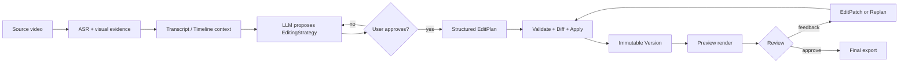

<div align="center">

# Video Agent Runtime

**Agent-native video editing, built around durable plans, reviewable versions, and deterministic rendering.**

*Edit video as structured data — not as opaque shell commands.*

[](https://github.com/YansIlinta/video-agent-runtime/actions/workflows/ci.yml)
[](LICENSE)
[](package.json)
[](package.json)

[Quick start](#quick-start)
·
[Agent & MCP](#agent--mcp)
·
[Speech & voice](#speech--voice)
·
[Mobile](#mobile-host)
·
[Documentation](docs/README.md)
·
[Benchmarks](docs/benchmarks.md)

</div>

## What is it?

Video Agent Runtime is a headless editing engine for agents such as Claude Code, Codex, or any MCP-capable client.

Instead of letting a model directly author FFmpeg commands, it turns media into durable project data:

**Transcript → EditingStrategy → EditPlan / EditPatch → Timeline → Version → Preview → Approval → Export**

The model decides *what should change*. The runtime validates *whether that change is allowed*, applies it transactionally, renders the result, and keeps every mutation reviewable and reversible.

It is designed first for talking-head video, interviews, podcasts, lectures, screen recordings, and long-form-to-short-form workflows.

> [!NOTE]
> This is **not a desktop NLE** and does not try to reproduce Premiere or CapCut. The primary interface is an agent, CLI, MCP client, or review-oriented mobile host.

## How it works



A typical interaction looks like:

```text
Import interview.mp4
↓
"剪成一分钟，开头抓人，删掉废话"
↓
Agent proposes a hook-first strategy
↓
User approves
↓
Runtime validates and applies an EditPlan
↓
Preview
↓
"前 20 秒还是太慢"
↓
Minimal EditPatch → new Version → new preview
↓
Final approval → export
```

## Core capabilities

| Area | What is implemented |
| --- | --- |
| **Durable edit model** | Integer-microsecond Timeline, first-class EditPlan and EditPatch, immutable Versions, atomic persistence and per-project locking |
| **Approval workflow** | Strategy proposal → approval → plan validation → preview → feedback → diagnosis/replan → final approval → export |
| **Structured planning** | JSON-Schema-constrained LLM output, independent Zod validation, repair retries, provider-call provenance and cancellation |
| **Transcript-first editing** | Timestamped words/segments, speakers, alignment provenance, transcript search and LLM-readable timeline context |
| **Speech & voice** | Local and hosted ASR/TTS, generated narration, duration fitting, authorized VoiceProfile cloning/design, dubbing and provenance |
| **Visual evidence** | On-demand shot/keyframe inspection rather than uploading the entire source video to a model |
| **Rendering** | FFmpeg preview/final renderer behind a capability contract; no agent-authored shell strings |
| **Durable jobs** | Bounded concurrency, progress events, retry classification, cancellation, idempotency and restart recovery |
| **Evaluation** | Deterministic CI evals plus opt-in real-provider ASR/LLM/TTS/voice-clone acceptance and benchmark aggregation |

## Speech & voice

Speech is a first-class editing subsystem, not a subtitle add-on. ASR produces the semantic timeline used by the editor; TTS and VoiceProfile outputs become explicit project assets and timeline clips.

### ASR

| Provider / runtime | Execution | Best fit | Notes |
| --- | --- | --- | --- |
| **faster-whisper** | Local | Mature general-purpose local ASR | Lightweight local baseline |
| **Qwen3-ASR** | Local | Chinese, multilingual and local high-quality transcription | Uses timestamp alignment for edit-safe output |
| **OpenAI transcription** | Hosted API | BYOK cloud transcription | Supports diarized segment mode or Whisper word timestamps depending on model |
| **WhisperX** | Local optional enrichment | Alignment / diarization | Fuses aligned words and speaker intervals back into the canonical Transcript |

### TTS and voice identity

| Provider / runtime | Execution | Capabilities |
| --- | --- | --- |
| **Kokoro** | Local | Lightweight preset TTS |
| **Qwen3-TTS** | Local | TTS, Voice Design, authorized zero-shot voice cloning, cross-lingual reuse |
| **OpenAI speech** | Hosted API | Hosted TTS / provider voices |

Voice cloning is never automatic. A cloned `VoiceProfile` requires explicit authorization evidence, a quality-checked reference, and—where the provider supports it—an exact transcript-backed reference range. Multi-speaker media is not silently guessed.

Model code, weights, voice assets, and hosted APIs may have different licenses or commercial terms. See [speech model research](docs/speech-models-2026.md) and [voice identity](docs/voice-identity.md) before shipping a provider configuration.

## Agent & MCP

All public surfaces are thin adapters over the same `VideoAgentCore`; they do not maintain separate project or timeline models.

| Surface | Entry point | Use case |
| --- | --- | --- |
| **CLI** | `video-agent` | Local development, scripting, debugging and explicit workflow control |
| **Project MCP** | `video-agent-mcp` | Full project-scoped editing tool surface for Claude Code, Codex and other MCP clients |
| **Speech MCP** | `video-agent-speech-mcp` | Lightweight ASR → structured LLM → TTS workflows without constructing the full editing graph |
| **Agent Skill** | [`skills/video-editing/SKILL.md`](skills/video-editing/SKILL.md) | Recommended agent workflow, review rules and safety boundaries |
| **Control API** | [docs/control-api.md](docs/control-api.md) | Narrow bearer-authenticated local HTTP control surface |
| **Mobile Host** | [docs/mobile/](docs/mobile/README.md) | Zero-server native host prototype using the same domain/runtime contracts |

### Connect Claude Code / Codex

Build the repository, then point an MCP-capable client at the stdio server:

```sh
npm install
npm run build
```

`mcp.example.json` contains a minimal configuration shape. Provider secrets are read from environment or secure host storage and are never written into project JSON.

## Quick start

### Requirements

- Node.js 22+
- FFmpeg / FFprobe for real media rendering
- Optional Python environment for local speech models

### Install and verify

```sh
npm install
npm run typecheck
npm test
npm run build
npm run smoke:mcp
npm run demo
```

`npm run demo` creates synthetic source media locally and drives the real project workflow through transcript → strategy → versions → previews → feedback patch → narration → final FFmpeg export.

Check the current machine without making a paid model call:

```sh
npm run cli -- doctor
```

### Configure providers

Copy the relevant values from `.env.example` into your environment.

```sh
# Workspace
VIDEO_AGENT_WORKSPACE=./video-projects

# Planner
VIDEO_AGENT_PLANNER=openai
OPENAI_MODEL=gpt-5.4-mini
OPENAI_API_KEY=...

# Local ASR example
VIDEO_AGENT_ASR=qwen3-asr
VIDEO_AGENT_ASR_MODEL=Qwen/Qwen3-ASR-0.6B

# Local TTS / voice example
VIDEO_AGENT_TTS=qwen3-tts
VIDEO_AGENT_TTS_MODEL=Qwen/Qwen3-TTS-12Hz-0.6B-Base
VIDEO_AGENT_PYTHON=python
```

Other supported choices are documented directly in [`.env.example`](.env.example).

## Real-provider validation

Normal CI intentionally does not download large speech models or use paid credentials. Real providers are verified through an explicit acceptance harness:

```sh
VIDEO_AGENT_REAL_ACCEPTANCE=true \
VIDEO_AGENT_ASR=qwen3-asr \
VIDEO_AGENT_PLANNER=openai \
VIDEO_AGENT_TTS=qwen3-tts \
OPENAI_API_KEY=... \
npm run eval:speech-real
```

The harness records real stage latency, ASR/TTS real-time factor, provider/model metadata, Node-controller RSS and coarse GPU memory when available. Authorized voice-clone acceptance must be enabled separately and cannot silently run against an arbitrary speaker.

After several runs, aggregate comparable results with:

```sh
npm run benchmark:speech-summary
```

See [real speech acceptance](docs/real-speech-acceptance.md), [benchmarks](docs/benchmarks.md), and [speech model research](docs/speech-models-2026.md).

## Mobile host

The mobile target is designed around a local-first, zero-application-server architecture:

```text
Mobile App
  ├── VideoAgentCore
  ├── durable ProjectRepository
  ├── Workflow / Job Queue
  ├── Timeline / EditPatch / Version
  ├── native media adapters
  └── direct BYOK provider access when configured
```

Source media stays on device by default; remote providers receive only the approved ContextPack/evidence required for inference. API credentials are referenced through secure host storage rather than project JSON.

> [!WARNING]
> The current iOS/Android implementation is still a **source-level native host prototype**. TypeScript/mobile contracts are checked in CI, but native Xcode/Gradle builds, physical-device media correctness, thermal behavior and background-export reliability still require the documented device validation pass.

Start at [docs/mobile/README.md](docs/mobile/README.md) and [native host status](docs/mobile/native-host-status.md).

## Architecture

```text
                 Agent / CLI / MCP / Mobile
                          │
                          ▼
                    VideoAgentCore
                          │
        ┌─────────────────┼──────────────────┐
        ▼                 ▼                  ▼
     Workflow          ProjectStore       Job Queue
        │                 │                  │
        └──────────┬──────┴──────────┬──────┘
                   ▼                 ▼
              Edit / Timeline    Provider contracts
                   │                 │
             Version / Diff     ASR / LLM / TTS
                   │                 │
                   └────────┬────────┘
                            ▼
                         Renderer
                            │
                         Preview
                            │
                      Review / Export
```

The main invariant is simple: **the runtime owns state; models propose structured changes.**

For package boundaries, persistence layout and recovery semantics, read [architecture.md](docs/architecture.md).

## Documentation & development

The README is the product entry point. Technical details live under [`docs/`](docs/README.md).

| Topic | Document |
| --- | --- |
| Architecture and durable state | [docs/architecture.md](docs/architecture.md) |
| Security and secret handling | [docs/security.md](docs/security.md) |
| Speech MCP | [docs/speech-mcp.md](docs/speech-mcp.md) |
| Speech model landscape | [docs/speech-models-2026.md](docs/speech-models-2026.md) |
| Voice identity and cloning | [docs/voice-identity.md](docs/voice-identity.md) |
| Real-provider acceptance | [docs/real-speech-acceptance.md](docs/real-speech-acceptance.md) |
| Benchmarks | [docs/benchmarks.md](docs/benchmarks.md) |
| Mobile host | [docs/mobile/README.md](docs/mobile/README.md) |
| Prior-art / upstream research | [docs/upstream-study.md](docs/upstream-study.md) |
| Release history | [CHANGELOG.md](CHANGELOG.md) |

## Project status

The Node runtime is the verified primary path: CLI, MCP, durable project state, FFmpeg rendering, jobs, deterministic evaluation, speech provider adapters and real-provider acceptance tooling are implemented and covered by CI where they do not require external model weights or paid credentials.

Real local-model quality, latency, VRAM and hosted-model behavior must still be measured on the target machine through the opt-in acceptance harness; CI does not pretend those runs happened.

The mobile host remains a source-level prototype until native compilation and real-device validation are completed.

## Security principles

- Agents never receive arbitrary shell execution through the editing API.
- Raw FFmpeg strings are not authoritative edit state.
- API keys are never persisted in project JSON, ProviderCall records or benchmark reports.
- Source media remains local unless a workflow explicitly authorizes remote evidence.
- Voice cloning requires explicit authorization and provenance.
- Unsupported renderer/provider capabilities fail explicitly rather than degrading silently.

See [docs/security.md](docs/security.md) for the full boundary.

## License

MIT. See [LICENSE](LICENSE).
